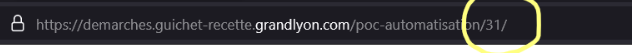
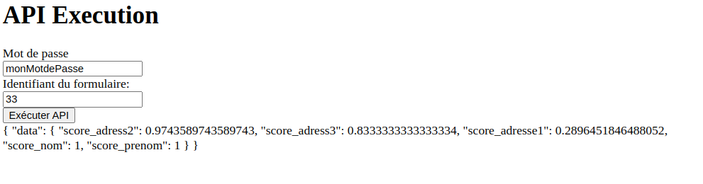

# 📄 Toodego Ocr API


[🇬🇧 English Documentation Here](README_EN.md)

Une api pour matcher l'identité d'une personne à partir d'un justificatif d'identité fourni sur la plateforme [Toodego](https://www.toodego.com/). projet experimental réalisé par les étudiants du Centrale Digital Lab

## Table des matières
- [📄 Toodego Ocr API](#-toodego-ocr-api)
  - [Table des matières](#table-des-matières)
  - [🗒 Prérequis](#-prérequis)
  - [🚀 Démarrage rapide](#-démarrage-rapide)
  - [🚴 Utilisation](#-utilisation)
  - [🚇 API](#-api)
    - [GET ?password=PASSWORD\&formId=FORM\_ID](#get-passwordpasswordformidform_id)
  - [❤️ Contributeurices](#️-contributeurices)


## 🗒 Prérequis
- [Docker](https://www.docker.com/)
- [Python](https://www.python.org/)
- [pip](https://pip.pypa.io/en/stable/installation/)

## 🚀 Démarrage rapide
Copiez le fichier `.env.example` en `.env` et remplissez les variables d'environnement.

```bash
cp .env.example .env
```

Lancez docker-compose pour démarrer l'application.
```bash
docker-compose up
```

## 🚴 Utilisation

1. Soumettre le formulaire sur le [site de recette de toodego ](https://demarches.guichet-recette.grandlyon.com/poc-automatisation/) et récupérer l'identifiant du formulaire 



1. accéder à l'url apit-toodego.example/form
2. remplir le formulaire avec l'identifiant récupéré le mot de passe (configuré dans env sous `API_BASE_URL` et cliquer sur exécuter, le résultat s'affiche dans en dessous du formulaire



## 🚇 API

Il est possible de récupérer directement le résultat du score de confiance en utilisant l'api suivante

### GET ?password=PASSWORD&formId=FORM_ID

- `password` : mot de passe pour accéder à l'api
- `formId` : identifiant du formulaire

Retourne un json avec le score de confiance

```json
{
    "data": {
        "score_adress2": number,
        "score_adress3": number,
        "score_adress1": number,
        "score_nom": number,
        "score_prenom": number,
    }
}
```


## ❤️ Contributeurices
- [Freeinkstein](https://github.com/Freeinkstein)