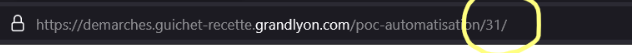
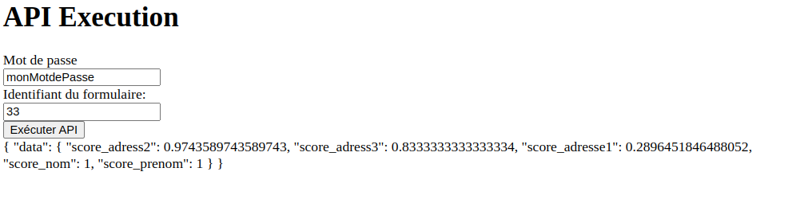

# 📄 Toodego Ocr API


[🇫🇷 French Documentation Here](README.md)

Une api pour matcher l'identité d'une personne à partir d'un justificatif d'identité fourni sur la plateforme [Toodego](https://www.toodego.com/). projet experimental réalisé par les étudiants du Centrale Digital Lab

## Table of contents
- [📄 Toodego Ocr API](#-toodego-ocr-api)
  - [Table of contents](#table-of-contents)
  - [🗒 Prerequisites](#-prerequisites)
  - [🚀 Quick start](#-quick-start)
  - [🚴 Usage](#-usage)
  - [🚇 API](#-api)
    - [GET ?password=PASSWORD\&formId=FORM\_ID](#get-passwordpasswordformidform_id)
  - [❤️ Contributors](#️-contributors)


## 🗒 Prerequisites
- [Docker](https://www.docker.com/)
- [Python](https://www.python.org/)
- [pip](https://pip.pypa.io/en/stable/installation/)

## 🚀 Quick start
Copy the `.env.example` file to `.env` and fill in the environment variables.

```bash
cp .env.example .env
```

Launch docker-compose to start the application.
```bash
docker-compose up
```

## 🚴 Usage

1. Submit the form on the [toodego recipe site ](https://demarches.guichet-recette.grandlyon.com/poc-automatisation/) and retrieve the form identifier 



1. access the url apit-toodego.example/form
2. fill in the form with the username and password (configured in env under `API_BASE_URL`) and click on execute, the result is displayed below the form.



## 🚇 API

You can retrieve the result of the trust score directly using the following api

### GET ?password=PASSWORD&formId=FORM_ID

- `password` : password to access the api
- formId` : form identifier

Returns a json with the trust score

```json
{
    "data": {
        "score_adress2": number,
        "score_adress3": number,
        "score_adress1": number,
        "score_name": number,
        "score_prenom": number,
    }
}
```


## ❤️ Contributors
- Freeinkstein](https://github.com/Freeinkstein)